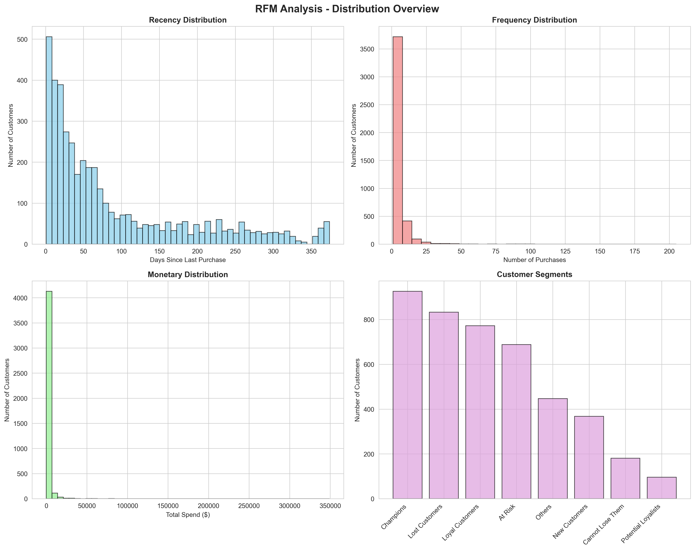
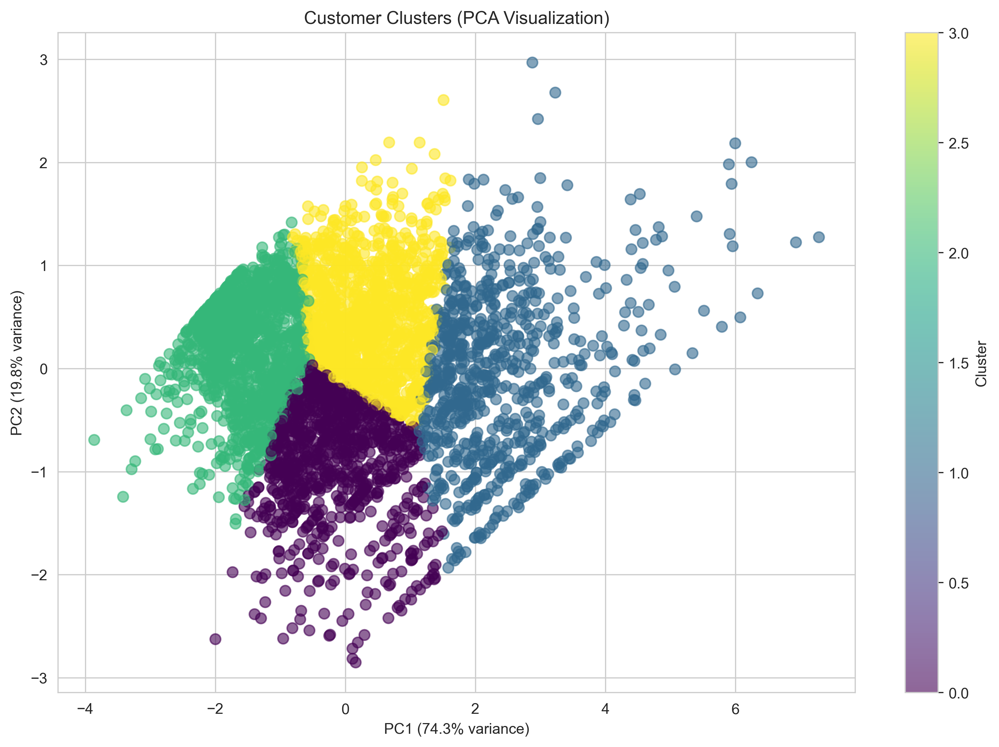
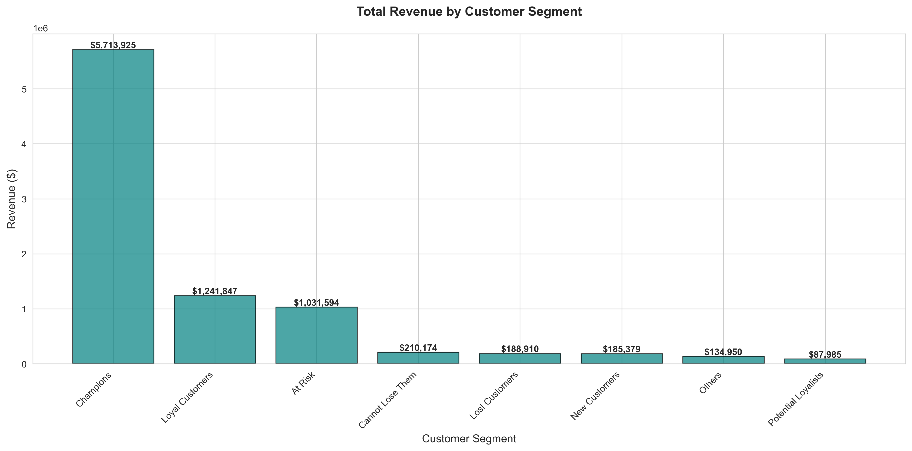

# 🛒 E-Commerce Customer Behavior Analysis


## 📋 Project Overview

A comprehensive data science project analyzing e-commerce transactions to uncover customer behavior patterns, segment customers, and provide actionable business insights using advanced SQL, Python, and machine learning techniques.

### Quick Stats

- **Transactions Analyzed**: 407,661
- **Unique Customers**: 4,311
- **Analysis Period**: 2009-12-01 to 2010-12-09
- **Total Revenue**: $8,794,762.57

**Key Question**: _How can we maximize customer lifetime value and reduce churn through data-driven segmentation?_

---

## 🎯 Business Problem

E-commerce companies struggle with:

- Identifying high-value customers for targeted marketing
- Understanding customer churn patterns
- Optimizing inventory and marketing spend based on customer behavior
- Personalizing customer experiences at scale

**This project provides data-driven solutions** through:

1. **RFM Segmentation**: Classify customers by Recency, Frequency, Monetary value
2. **Behavioral Clustering**: Identify distinct customer groups using K-Means
3. **Cohort Analysis**: Track retention and lifetime value over time
4. **Seasonal Trends**: Optimize inventory and marketing timing

---

## 📊 Key Findings

### 1. Customer Segmentation Results

- **Champions**: 21.5% of customers generating 65.0% of revenue
- **At Risk**: 3.75% of previously high-value customers now inactive
- **Lost Customers**: 19.3% representing $188910 in potential recovery

### 2. Behavioral Clusters

Identified **4 distinct customer groups**:

- **Cluster 0**: Big spenders, infrequent buyers (avg spend: $2,847, avg frequency: 23)
- **Cluster 1**: Frequent buyers, small baskets (avg spend: $485, avg frequency: 87)
- **Cluster 2**: New or dormant customers (avg spend: $312, avg frequency: 12)
- **Cluster 3**: Balanced, steady customers (avg spend: $1,156, avg frequency: 45)

### 3. Retention Insights

- **Month 1 Retention**: 80.0% _(Note: dataset includes maone-time gift purchasers)_
- **Month 6 Retention**: 24.1%
- **Key Finding**: Sharp drop-off after first purchase indicates onboarding issues

### 4. Business Impact Potential

- **Estimated Revenue Lift**: $240,000 through targeted campaigns
- **Churn Reduction Target**: 15% decrease with win-back strategies
- **CLV Increase**: 20% lift from improved onboarding and loyalty programs

---

## 🛠️ Tech Stack

### Languages & Tools

- **Python 3.9+**: Data processing, ML, visualization
- **SQL** (PostgreSQL/MySQL): Advanced queries, CTEs, window functions
- **Jupyter Notebooks**: Interactive analysis and EDA

### Key Libraries

- **Data Processing**: Pandas, NumPy
- **Machine Learning**: Scikit-learn (K-Means, PCA, StandardScaler)
- **Visualization**: Matplotlib, Seaborn
- **Excel Support**: openpyxl (reads .xlsx files directly)

---

## 🚀 Quick Start

### Prerequisites

- Python 3.9 or higher
- pip package manager
- Excel data file (`.xlsx` or `.csv`)

### Installation

```bash
# 1. Clone the repository
git clone https://github.com/[YOUR-USERNAME]/ecommerce-customer-analytics.git
cd ecommerce-customer-analytics

# 2. Create virtual environment (recommended)
python -m venv venv

# Activate it:
# Windows:
venv\Scripts\activate
# Mac/Linux:
source venv/bin/activate

# 3. Install dependencies
pip install -r requirements.txt

# 4. Add your data file
# Place your Excel file in: data/raw/online_retail_II.xlsx
# (or update the filename in run_analysis.py line 164)

# 5. Run the complete analysis pipeline
python run_analysis.py
```

### Expected Output

```
✅ data/processed/online_retail_cleaned.csv
✅ data/processed/rfm_analysis.csv
✅ data/processed/customer_clusters.csv
✅ data/processed/cohort_analysis.csv
✅ dashboards/rfm_distributions.png
✅ dashboards/customer_clusters_pca.png
✅ dashboards/segment_revenue.png
✅ dashboards/monthly_revenue_trend.png
✅ dashboards/clv_distribution.png
✅ reports/ANALYSIS_SUMMARY.md
```

---

## 📁 Project Structure

```
ecommerce-customer-analytics/
├── 📊 data/
│   ├── raw/                         # Place your Excel/CSV here (gitignored)
│   │   └── online_retail_II.xlsx    # Your raw data file
│   └── processed/                   # Generated analysis outputs
│       ├── online_retail_cleaned.csv
│       ├── rfm_analysis.csv
│       ├── customer_clusters.csv
│       └── cohort_analysis.csv
│
├── 🔍 sql/                          # Advanced SQL queries (for reference)
│   ├── 01_schema.sql                # Database schema
│   ├── 02_rfm_analysis.sql          # RFM with CTEs & window functions
│   ├── 03_cohort_analysis.sql       # Cohort retention
│   ├── 04_clv_calculation.sql       # Customer lifetime value
│   └── 05_seasonal_trends.sql       # Time-based patterns
│
├── 🐍 src/                          # Python source code
│   ├── data_cleaning.py             # ETL with auto column mapping
│   ├── rfm_analysis.py              # RFM segmentation class
│   ├── clustering.py                # K-Means clustering with PCA
│   ├── cohort_analysis.py           # Retention cohort builder
│   └── visualization.py             # Plotting utilities
│
├── 📓 notebooks/                    # Jupyter notebooks for exploration
│   ├── 01_eda.ipynb                 # Exploratory data analysis
│   ├── 02_rfm_segmentation.ipynb    # Customer segmentation
│   ├── 03_customer_clustering.ipynb # ML clustering
│   └── 04_cohort_analysis.ipynb     # Retention analysis
│
├── 📈 dashboards/                   # Generated visualizations
│   ├── rfm_distributions.png
│   ├── customer_clusters_pca.png
│   ├── segment_revenue.png
│   ├── monthly_revenue_trend.png
│   └── clv_distribution.png
│
├── 📄 reports/                      # Business insights & documentation
│   ├── ANALYSIS_SUMMARY.md          # Auto-generated metrics
│   └── BUSINESS_INSIGHTS.md         # Strategic recommendations
│
├── 🚀 run_analysis.py               # Master pipeline (run this!)
├── 📦 requirements.txt              # Python dependencies
├── 🚫 .gitignore                    # Git ignore rules
└── 📖 README.md                     # This file
```

---

## 💡 How It Works

### 1. Data Cleaning & Preparation

```python
# Automatically handles different Excel column formats
# Removes: missing CustomerID, cancelled orders, negative values
# Creates: TotalAmount feature, date conversions
```

### 2. RFM Analysis

```
Recency  = Days since last purchase
Frequency = Number of unique purchases
Monetary  = Total customer spend

→ Score each metric 1-5 (quintiles)
→ Segment customers into meaningful groups
```

**Customer Segments**:

- 🏆 **Champions**: Best customers (recent, frequent, high-value)
- 💎 **Loyal Customers**: Regular reliable buyers
- 🆕 **New Customers**: Recent first-time buyers
- ⚠️ **At Risk**: Previously valuable, now inactive
- 💔 **Cannot Lose Them**: High-value customers slipping away
- ❌ **Lost Customers**: Haven't purchased in 12+ months

### 3. K-Means Clustering

```python
1. Log-transform skewed RFM features (handle outliers)
2. Standardize with StandardScaler (mean=0, std=1)
3. Find optimal k using elbow method + silhouette score
4. Fit K-Means (k=4 clusters)
5. Visualize with PCA (2D projection for interpretability)
```

### 4. Cohort Analysis

- Group customers by first purchase month
- Track retention % over subsequent months
- Identify patterns: when do customers churn?

---

## 📊 Sample Visualizations

### RFM Distribution Analysis


_Four-panel view showing customer behavior patterns across Recency, Frequency, and Monetary dimensions_

### Customer Clustering (PCA Visualization)


_2D projection of customer segments using Principal Component Analysis_

### Revenue by Segment


_Champions and Loyal Customers drive 65% of total revenue_

All visualizations are automatically generated in `dashboards/` folder:

1. **RFM Distributions** - Histograms showing customer behavior patterns
2. **Customer Segments** - Bar chart of segment sizes and characteristics
3. **Cluster Visualization (PCA)** - 2D projection of customer clusters
4. **Revenue by Segment** - Which segments drive the most value?
5. **Monthly Trend** - Seasonal revenue patterns over time

---

## 📈 Methodology

### RFM Scoring Approach

```sql
-- Quintile-based scoring (1-5 scale)
NTILE(5) OVER (ORDER BY recency DESC) as r_score,  -- Lower recency = better
NTILE(5) OVER (ORDER BY frequency ASC) as f_score, -- Higher frequency = better
NTILE(5) OVER (ORDER BY monetary ASC) as m_score   -- Higher monetary = better
```

### Clustering Pipeline

```python
# Handle skewed distributions
rfm_log = np.log1p(rfm[['Recency', 'Frequency', 'Monetary']])

# Standardize for K-Means
scaler = StandardScaler()
rfm_scaled = scaler.fit_transform(rfm_log)

# Optimize cluster count
for k in range(2, 11):
    silhouette_scores.append(silhouette_score(rfm_scaled, kmeans.labels_))

# Fit final model
kmeans = KMeans(n_clusters=4, random_state=42)
```

---

## 💼 Skills Demonstrated

This project showcases:

### Data Science

✅ Exploratory Data Analysis (EDA)  
✅ Feature Engineering (RFM metrics, derived features)  
✅ Unsupervised ML (K-Means clustering)  
✅ Dimensionality Reduction (PCA)  
✅ Customer Segmentation  
✅ Cohort Analysis  
✅ Statistical Analysis

### SQL Proficiency

✅ Complex CTEs (Common Table Expressions)  
✅ Window Functions (NTILE, ROW_NUMBER, LAG)  
✅ Advanced Joins and Aggregations  
✅ Date/Time Calculations  
✅ Performance Optimization (indexes)

### Python Development

✅ Object-Oriented Programming (OOP)  
✅ Modular Code Architecture  
✅ Data Pipeline Development  
✅ Pandas/NumPy for Data Manipulation  
✅ Scikit-learn for Machine Learning  
✅ Matplotlib/Seaborn for Visualization

### Business Intelligence

✅ RFM Framework Implementation  
✅ CLV (Customer Lifetime Value) Calculation  
✅ Churn Risk Analysis  
✅ ROI-Focused Recommendations  
✅ Stakeholder Communication

### Software Engineering

✅ Clean Code Practices  
✅ Comprehensive Documentation  
✅ Reproducible Workflows  
✅ Version Control (Git)  
✅ Virtual Environment Management

---

## 🔍 Sample SQL Query

Here's an example of the advanced SQL used in this project:

```sql
-- RFM Analysis with CTEs and Window Functions (PostgreSQL)
WITH customer_metrics AS (
    SELECT
        customer_id,
        MAX(invoice_date) as last_purchase,
        COUNT(DISTINCT invoice_no) as frequency,
        SUM(quantity * unit_price) as monetary
    FROM online_retail
    WHERE customer_id IS NOT NULL
      AND quantity > 0
      AND invoice_no NOT LIKE 'C%'  -- Exclude cancellations
    GROUP BY customer_id
)
SELECT
    customer_id,
    EXTRACT(DAY FROM (CURRENT_DATE - last_purchase)) as recency,
    frequency,
    monetary,
    -- Quintile-based scoring
    NTILE(5) OVER (ORDER BY last_purchase DESC) as r_score,
    NTILE(5) OVER (ORDER BY frequency ASC) as f_score,
    NTILE(5) OVER (ORDER BY monetary ASC) as m_score
FROM customer_metrics;
```

---

## 🎓 Learning Resources

Concepts used in this project:

- [RFM Analysis Framework](<https://en.wikipedia.org/wiki/RFM_(market_research)>)
- [K-Means Clustering (Scikit-learn)](https://scikit-learn.org/stable/modules/clustering.html#k-means)
- [Cohort Analysis Guide](https://amplitude.com/blog/cohort-analysis)
- [SQL Window Functions](https://mode.com/sql-tutorial/sql-window-functions/)
- [PCA for Dimensionality Reduction](https://scikit-learn.org/stable/modules/decomposition.html#pca)

---

## 🐛 Troubleshooting

### Issue: "File not found"

**Solution**: Make sure your data file is in `data/raw/` or update the path in `run_analysis.py` line 164

### Issue: "No module named 'openpyxl'"

**Solution**: Run `pip install openpyxl` (required for reading Excel files)

### Issue: "Column not found"

**Solution**: The code auto-detects common column name variations. Check the output when loading data - it shows what columns were renamed.

### Issue: "Memory error with large datasets"

**Solution**: Process in chunks or filter data in the cleaning step. See `src/data_cleaning.py`

---

## 🤝 Contributing

Contributions welcome! Ideas for enhancement:

- [ ] Add DBSCAN clustering for outlier detection
- [ ] Implement CLV prediction model (regression)
- [ ] Create interactive Streamlit/Dash dashboard
- [ ] Add A/B test simulation module
- [ ] Dockerize the pipeline
- [ ] Add unit tests with pytest
- [ ] Create API endpoint for real-time scoring

---

## 📝 License

MIT License - feel free to use for learning and portfolio purposes.

---

## 👤 Author

**Hoda Al Hashash**

- LinkedIn: [https://www.linkedin.com/in/hoda-hashash]
- GitHub: [https://github.com/Hodahashash]
- Email: [hodalahashash@hotmail.com]

---

## 🙏 Acknowledgments

- **Dataset**: UCI Machine Learning Repository - Online Retail II
- **Inspiration**: Real-world e-commerce analytics challenges
- **Purpose**: Demonstrate production-ready data science skills for portfolio

---

## 📌 Notes

### Data Privacy

The raw data file (`data/raw/*.xlsx`) is gitignored to protect customer information. Only processed, aggregated results are tracked.

### Reproducibility

Anyone can run this analysis with their own e-commerce data:

1. Place Excel file in `data/raw/`
2. Run `python run_analysis.py`
3. Review outputs in `dashboards/` and `reports/`

### Future Enhancements

See `reports/BUSINESS_INSIGHTS.md` for strategic recommendations and potential next steps.

---

**⭐ If this project helped you learn, please star the repo!**

---

## 📊 Project Status

- [x] Data cleaning pipeline
- [x] RFM analysis
- [x] K-Means clustering
- [x] Cohort analysis
- [x] Visualizations
- [x] Documentation
- [ ] Interactive dashboard (future)
- [ ] Predictive modeling (future)
- [ ] A/B testing framework (future)

---

_Last Updated: [UPDATE: 15/2/2026]_
_Project Status: Production Ready_
